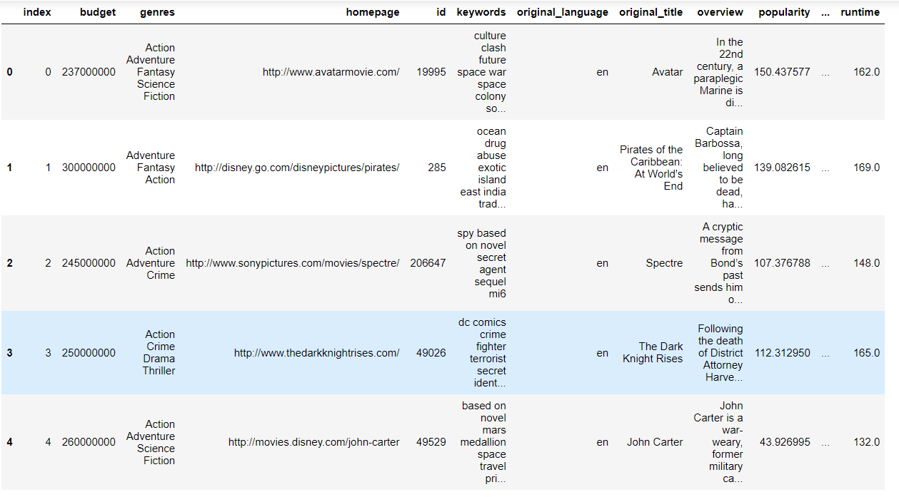
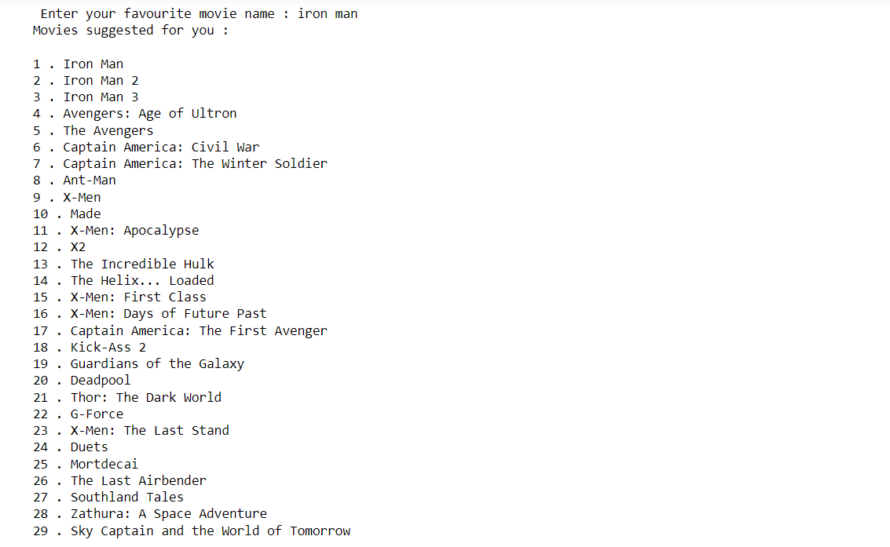

# Movie Recommendation System 🎬

This Movie Recommendation System suggests similar movies based on features such as genres, cast, and directors. By using natural language processing techniques like **TF-IDF Vectorizer** and **Cosine Similarity**, the system identifies the most relevant movies from a dataset of over 4,800 entries. 

## Features:
- **Content-Based Filtering**: Recommends movies based on metadata like genre, cast, director, and keywords.
- **Efficient Data Processing**: Converts movie data into numerical format using **Scikit-learn** to provide similarity-based recommendations.
- **Customizable Search**: Users can enter the name of any movie and receive a list of top similar movies.

## How It Works:
1. **TF-IDF Vectorizer** transforms text-based movie metadata (genres, cast, etc.) into numerical vectors.
2. **Cosine Similarity** calculates the similarity between the entered movie and others in the dataset.
3. The system returns the top similar movies based on calculated similarity scores.

## Technologies Used:
- **Python**: Core language for building the application.
- **Scikit-learn**: Used for implementing the TF-IDF vectorizer and Cosine Similarity.
- **Pandas**: For data manipulation and cleaning.
- **NumPy**: For numerical operations.
  
## Dataset:
The system processes a dataset of over 4,800 movies, including metadata like titles, genres, cast, director, keywords, and more.

## Screenshots:

*4800 movies dataset.*

*Enter the movie name and get recommendations*

## Getting Started:
To run the project locally:
1. Clone the repository.
2. Install dependencies using `pip install -r requirements.txt`.
3. Run the `main.py` script and start getting movie recommendations!

## Future Enhancements:
- Adding user-based collaborative filtering.
- Improving the UI for better interaction.

Feel free to try it out, contribute, or suggest improvements!
